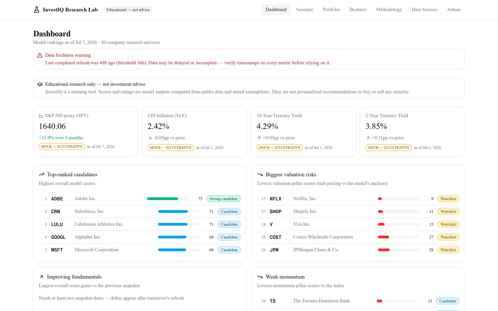
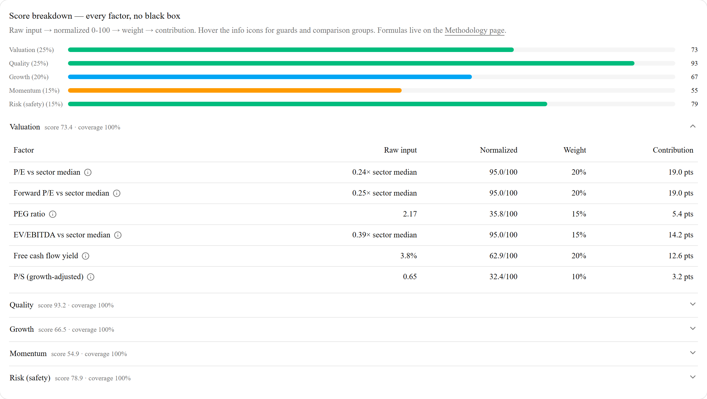
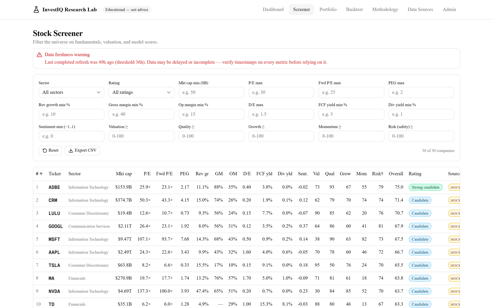
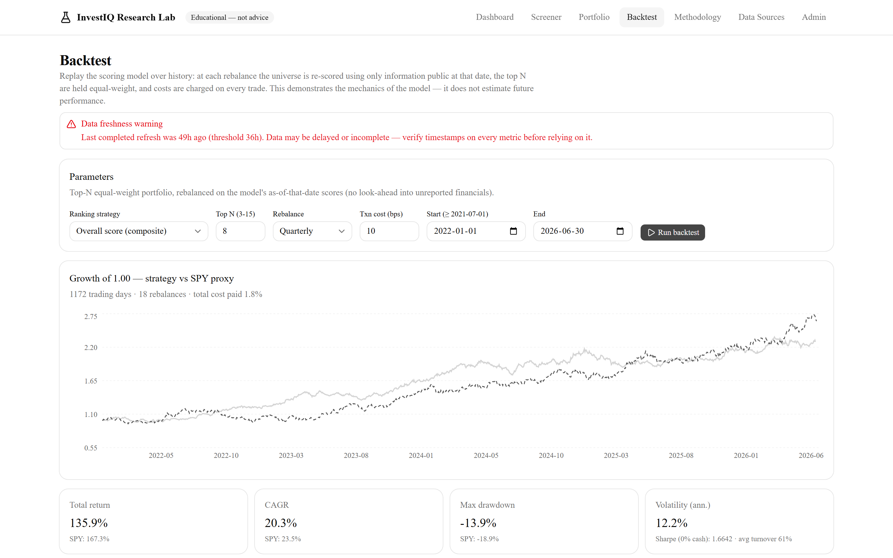

# InvestIQ Research Lab

An **educational** stock research platform that ranks a fixed 30-company
universe with a transparent, fully explainable scoring model — and works out
of the box with **zero API keys**.

> **Not financial advice.** InvestIQ is a learning tool. Every rating is a
> model output computed from stated inputs, weights, and assumptions — never a
> personalized recommendation. Data may be delayed, incomplete, or simulated.
> See the in-app Methodology and Data Sources pages.

## Screenshots

**Dashboard** — rankings, valuation risks, macro tiles, filing/news alerts,
freshness banner; every datum badged with its source:



**Score breakdown** — the core idea: every factor's raw input → normalized
score → weight → contribution, with guard notes. No black box:



**Screener** — 18 filters across fundamentals, valuation, and model scores:



**Backtest** — the model replayed over history with as-of scoring (no
look-ahead), transaction costs, and a prominent limitations panel:



## What it does

- **Data pipeline** — pulls prices, fundamentals, SEC filings, macro
  indicators, and news through swappable provider adapters
  (SEC EDGAR · FRED · Alpha Vantage · Finnhub · FMP · CSV import · deterministic
  mock). Providers fail over in configurable chains that always end at the
  mock, so a refresh can never crash outright.
- **Scoring engine** — five pillars (Valuation 25% · Quality 25% · Growth 20% ·
  Momentum 15% · Risk 15%) built from ~29 factors. Every factor shows its raw
  input, normalization anchors, weight, and contribution. No black box.
- **Educational ratings** — Strong candidate / Candidate / Watchlist / Avoid,
  with explicit overrides (e.g. interest coverage < 1× caps the rating) and a
  "what would change my mind" section computed by inverting the thresholds.
- **Pages** — dashboard, screener (18 filters), stock detail with full score
  breakdown, methodology (rendered from the live scoring constants),
  watchlist + mock portfolio with concentration warnings, markdown research
  reports, an as-of backtester, and an admin/data-quality console.
- **Automation** — daily GitHub Actions refresh, manual
  `npm run refresh`, structured JSON logging, response caching, per-provider
  rate limiting, daily score snapshots.

## Quickstart (Windows 11, macOS, or Linux)

Prerequisites: Node.js ≥ 20.9 and npm. Nothing else — no Docker, no database
server, no API keys.

```bash
git clone <your-fork-url> investiq-research-lab
cd investiq-research-lab
npm install
copy .env.example .env        # cp on macOS/Linux — works unchanged
npm run setup                 # migrate + seed 30 companies + first data load
npm run dev                   # http://localhost:3000
```

The first `npm run setup` populates ~52,000 mock price bars, fundamentals,
filings, news, and macro series, then computes metrics, scores, and rankings
(~30 seconds). Everything mock is badged "mock — illustrative" in the UI.

**Want real data?** Add `SEC_EDGAR_USER_AGENT="Your Name you@example.com"` to
`.env` (no key needed) and re-run `npm run refresh` — real SEC filings and
XBRL fundamentals flow in immediately. Free keys for FRED / Alpha Vantage /
Finnhub / FMP unlock the rest; see `.env.example`.

## Commands

| Command | Purpose |
|---|---|
| `npm run dev` | dev server |
| `npm run setup` | first-time: migrate + seed + refresh |
| `npm run refresh` | manual data refresh (`-- --steps=prices,scores --tickers=AAPL`) |
| `npm run check` | lint + typecheck + full test suite |
| `npm test` | Vitest (170+ tests) |
| `npm run build` / `start` | production build / serve |
| `npm run db:studio` | Prisma Studio DB browser |

## Architecture in one diagram

```
providers (sec-edgar, fred, alpha-vantage, finnhub, fmp, csv, mock)
   │  Zod-validated payloads · cache · rate limits · retry · fallback chains
   ▼
pipeline (fetch steps → metrics → scores → ranks → snapshot)   [UpdateRun log]
   ▼
SQLite via Prisma  ──►  queries layer  ──►  pages + API routes
                          ▲
        pure engines: lib/metrics · lib/scoring · lib/backtest
        (no DB, no fetch — fully unit-tested with hand-computed cases)
```

Key rules (enforced by tests + `AGENTS.md`): scoring/metrics/backtest are pure;
adapters live only in `lib/providers`; every external payload is Zod-validated;
chains end at mock; every displayed datum carries source + asOf timestamp; a
compliance test bans promissory language ("guaranteed", "will go up", …) from
the entire source tree and all generated narratives.

## Documentation

- [docs/SETUP_WINDOWS.md](docs/SETUP_WINDOWS.md) — detailed Windows 11 guide
- [docs/DEPLOYMENT.md](docs/DEPLOYMENT.md) — production, Docker, PostgreSQL, scheduling
- [docs/DATA_SOURCES.md](docs/DATA_SOURCES.md) — providers, rate limits, CSV formats, honest limitations
- [docs/ROADMAP.md](docs/ROADMAP.md) — v2 plans
- In-app: `/methodology` (scoring model from live constants) and `/data-sources`

## Testing

`npm run check` runs ESLint, `tsc --noEmit`, and the Vitest suite: scoring
formulas against hand-computed expectations, normalization edge cases, ranking
determinism, provider fallback behavior (error → next adapter), pipeline
failure isolation (one provider failing → PARTIAL, never a crash), CSV import
round-trips, backtest engine fixtures, report generation, and the banned-phrase
compliance scan. Network smoke tests against real SEC EDGAR run only with
`LIVE_SMOKE=1`.

## How this was built

I ([Ahmed Hamzah Hashmi](https://github.com/hashmihamzah2002)) designed and
directed this project; the implementation was AI-assisted using
[Claude Code](https://claude.com/claude-code). Concretely, my side of the work:

- **Product & methodology design** — the five-pillar scoring model (weights,
  factor selection, the rule that insufficient data forces a "Watchlist"
  rating), the fixed 30-company universe, and the requirement that every score
  be traceable from raw input to final rating.
- **Compliance requirements** — educational-only framing, banned promissory
  language enforced by an automated test, source + timestamp attribution on
  every displayed metric, portfolio concentration warnings, and no
  brokerage/trading functionality of any kind.
- **Build direction & acceptance** — a reviewed architecture plan up front,
  then ten phases delivered against it, each gated on a green
  lint + typecheck + test run; I reviewed outputs and made the calls when
  trade-offs came up (e.g. SQLite over Postgres for zero-setup Windows dev,
  honest mock-data badging over fake realism).

The commit history reflects this honestly — commits carry a
`Co-Authored-By: Claude` trailer. I think directing AI tooling well is a
skill worth demonstrating, and this repo is my evidence.

## License / usage note

MIT — see [LICENSE](LICENSE). Educational project. Free-tier data APIs are
generally licensed for personal, non-commercial use — review each provider's
terms before any other use.
